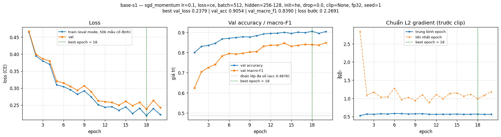
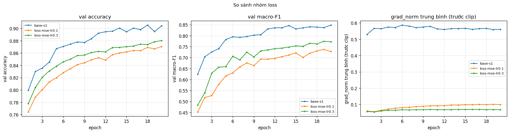
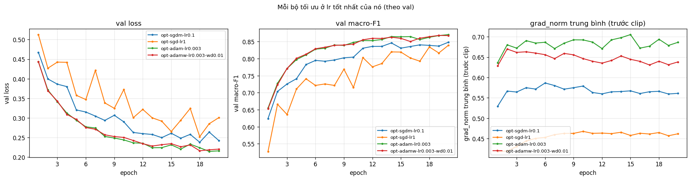
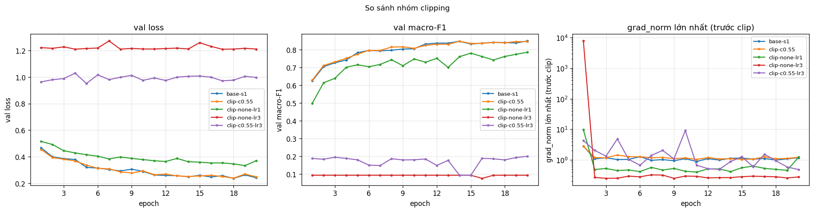
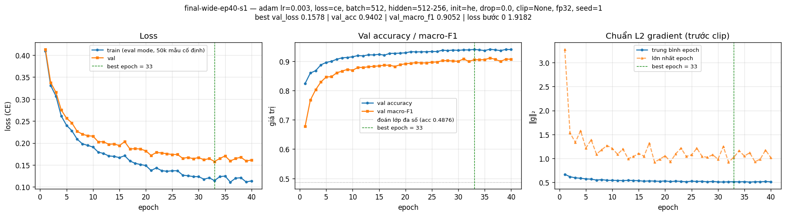

# Báo cáo Lab Day 1 — Phạm Minh Hiếu — 2A202602630

## 1. Thiết lập

- **Môi trường:** Google Colab, GPU Tesla T4, PyTorch 2.11.0+cu130. Toàn bộ dữ liệu nằm trên GPU, chia lô bằng `torch.randperm`. Tổng thời gian huấn luyện của 36 lần chạy khoảng 18 phút.
- **Dữ liệu:** Forest CoverType. `train` 464 809 / `eval` 116 203 theo `split_metadata.csv`. Validation = 20% của train (phân tầng, seed 42) → 371 847 train / 92 962 val. Chuẩn hoá 10 cột số bằng mean/std của phần train còn lại; 44 cột one-hot giữ nguyên.
- **Model:** `M-base` (54 → 256 → 128 → 7, ReLU, 47 879 tham số).
- **Baseline:** cross-entropy, SGD + momentum 0,9, lr = 0,1 (chọn bằng val trong {0,01; 0,03; 0,1}), batch 512, 20 epoch, khởi tạo He, không dropout, không clip, FP32. Metric báo cáo ở epoch có val loss thấp nhất.
- **Mốc tham chiếu:** accuracy "đoán lớp đa số" trên val = 0,4876.
- **Các chủ đề đã thử:** ☑ loss ☑ optimizer ☑ hyper-parameter ☑ dropout ☑ clipping ☑ mixed precision ☑ init (36 lần chạy, xem `experiments.xlsx`).

## 2. Kiểm tra ban đầu và độ nhiễu

| Kiểm tra | Kết quả |
|---|---|
| Số tham số / shape logits | 47 879 (có `assert`) / (B, 7) |
| Loss bước 0 (ln 7 = 1,946) | 2,269 với He, seed 1 (seed 2, 3: 1,978 và 1,901); 1,946 với `normal`/`zeros` |
| Quá khớp 20 mẫu: loss cuối | 6,6e-6, accuracy 100% sau 300 bước Adam |
| Mọi tham số có gradient khác 0 | ☑ có (‖g‖ từ 0,34 đến 2,02 cho W1, b1, W2, b2, W3, b3) |
| Baseline, số seed đã chạy | 3 (`base-s1`, `base-s2`, `base-s3`) |
| Baseline: val acc (TB ± σ) | 0,9082 ± 0,0024 |
| Baseline: val macro-F1 (TB ± σ) | 0,8535 ± 0,0126 |

Loss bước 0 với He lớn hơn ln 7 khoảng 0,3. Lý do: He giữ phương sai qua các lớp ReLU nên logits ban đầu có std ≈ 0,58 thay vì ≈ 0, softmax không đều. Đây không phải lỗi. Mức lệch dao động theo seed (1,90–2,27).

**Ngưỡng nhiễu dùng trong báo cáo:** 2σ = **0,025** (val macro-F1, 3 seed). Mọi thí nghiệm ở mục 3 dùng seed 1 và được so với trung bình baseline. `base-s1` là seed thấp nhất (0,839), nên cách so này thận trọng. Với 3 seed, σ chỉ là ước lượng thô.

Đường cong baseline: val loss giảm nhanh 5 epoch đầu (0,468 → 0,320) rồi chậm dần. Best epoch là 18–19 ở cả 3 seed: **chưa hội tụ hẳn và chưa quá khớp** (val − train loss = 0,021).

## 3. Kết quả theo chủ đề

Δ là chênh lệch val macro-F1 so với trung bình baseline 0,8535. "Vượt nhiễu" nghĩa là |Δ| > 0,025.

### 3.1 Hàm mất mát: CE vs MSE
- **Dự đoán:** MSE học chậm hơn và có macro-F1 thấp hơn, vì gradient theo logit nhỏ và không gắn với xác suất.
- **Kết quả:** `loss-mse-lr0.1` đạt 0,728 (Δ −0,126); `loss-mse-lr0.3` đạt 0,773 (Δ −0,081). Cả hai **vượt nhiễu**. Ảnh: `compare_loss.png`.
- **Giải thích:** gradient của CE theo logit là `p − y`. Nó không bão hoà khi mô hình sai nặng. MSE (`nn.MSELoss`, trung bình trên B·7 phần tử) có gradient `2(z − y)/7`: nhỏ hơn và phạt cả những logit đúng nhưng lớn. Đo được trung vị ‖g‖ của MSE là 0,065–0,085, so với 0,55 của CE. Tăng lr ×3 bù được một phần (+0,045) nhưng vẫn kém CE 0,08: độ lớn gradient là một phần nguyên nhân, phần còn lại là hình dạng của hàm mất mát. Không so trực tiếp giá trị loss (khác thang đo).

### 3.2 Bộ tối ưu hoá
- **Dự đoán:** Adam hội tụ nhanh hơn ở các epoch đầu; ở lr tốt nhất của mỗi bộ, chênh lệch có thể không vượt nhiễu. SGD thuần cần lr lớn hơn khoảng 10 lần.

| Bộ tối ưu | lr đã thử | lr tốt nhất | val macro-F1 | best epoch | Δ |
|---|---|---|---|---|---|
| SGD+momentum 0,9 | 0,01 / 0,03 / 0,1 | 0,1 (`opt-sgdm-lr0.1`) | 0,839 | 18 | −0,015 |
| SGD | 0,3 / 1,0 | 1,0 (`opt-sgd-lr1`) | 0,834 | 18 | −0,019 |
| Adam | 3e-4 / 1e-3 / 3e-3 | 3e-3 (`opt-adam-lr0.003`) | **0,868** | 19 | +0,014 |
| AdamW (wd 0,01) | 1e-3 / 3e-3 | 3e-3 (`opt-adamw-lr0.003-wd0.01`) | 0,865 | 18 | +0,011 |

- **Hội tụ sớm:** Adam lr 3e-3 đạt F1 0,655 / 0,811 / 0,848 ở epoch 1 / 5 / 10, so với 0,624 / 0,782 / 0,805 của SGD+momentum.
- **Nhưng ở lr tốt nhất, không cặp nào vượt 2σ.**
- **Độ nhạy với lr** lớn hơn khác biệt giữa các bộ: tăng lr ×10 làm F1 tăng 0,08 (SGD+m) và 0,08 (Adam). Cả 4 bộ đều cho lr tốt nhất ở đầu trên của lưới đã thử.
- **Giải thích:**
  - SGD thuần ở lr 1,0 ≈ SGD+momentum ở lr 0,1, đúng với bước hiệu dụng `η/(1−μ)`. Đường SGD thuần dao động hơn (F1 tụt về 0,715 ở epoch 10).
  - Adam chia bước theo `√v̂` của từng tham số, nên các tham số ít được cập nhật (ví dụ trọng số nối với các cột Soil_Type hiếm) vẫn nhận bước đủ lớn. Đây là phỏng đoán phù hợp với việc Adam học nhanh hơn ở đầu.
  - Adam ≈ AdamW (cả hai lr): weight decay 0,01 không có tác dụng khi chưa quá khớp.

### 3.3 Hyper-parameter

| exp_id | thay đổi | bước/epoch | s/epoch | val macro-F1 | Δ |
|---|---|---|---|---|---|
| `hp-batch128` | batch 128 | 2 906 | 4,76 | 0,856 | +0,003 |
| `hp-batch2048` | batch 2048, cùng lr | 182 | 0,31 | 0,797 | **−0,057** |
| `hp-batch2048-lr0.4-warmup` | batch 2048, lr ×4, khởi động 1 epoch | 182 | 0,34 | 0,850 | −0,004 |
| `hp-wide` | 512-256 (161 287 tham số) | 727 | 1,28 | 0,874 | +0,020 |
| `hp-deep` | 256-128-64 (55 687 tham số) | 727 | 1,41 | 0,865 | +0,011 |

- **Batch 2048 cùng lr** tệ hơn và **vượt nhiễu**: cùng 20 epoch nhưng chỉ có 3 640 bước cập nhật, so với 14 540 ở batch 512.
- **Quy tắc "lô ×k thì η ×k" kèm khởi động** bù gần hết khoảng cách (trong nhiễu), lại nhanh gấp 3,6 lần mỗi epoch. Thí nghiệm này đổi 3 yếu tố cùng lúc và đã ghi rõ trong bảng.
- **Thời gian mỗi epoch** tỉ lệ với **số bước**, không với số mẫu: mạng nhỏ nên chi phí mỗi bước bị chi phối bởi việc gọi kernel. Vì vậy batch 128 chậm gấp 3,9 lần mà chỉ tăng +0,003.
- **Mạng rộng/sâu hơn** cho val loss thấp hơn rõ (0,204 / 0,207 so với 0,243) và F1 cao hơn, nhưng **chưa vượt 2σ** khi chỉ chạy 1 seed. Mô hình đang thiếu năng lực chứ không thừa (xem 3.4).

### 3.4 Dropout
- **Dự đoán:** dropout làm hại vì baseline chưa quá khớp.
- **Kết quả:** `drop-0.1` đạt 0,840 (Δ −0,013, trong nhiễu); `drop-0.3` đạt 0,788 (Δ −0,066, **vượt nhiễu**). Ảnh: `compare_dropout.png`.
- **Giải thích:** khoảng cách val − train loss giảm từ 0,021 xuống 0,011 / 0,006, nhưng là do train loss (đo ở eval mode) tăng, không phải val loss giảm (0,243 → 0,248 / 0,315). Dropout giảm năng lực hiệu dụng và làm gradient nhiễu hơn. Mô hình này **chưa quá khớp** (370 nghìn mẫu, 48 nghìn tham số, best epoch ≈ epoch cuối), nên không có gì cho dropout chữa. Dropout chỉ nên dùng khi val loss bắt đầu tăng trong lúc train loss vẫn giảm, ví dụ với mô hình lớn hơn nhiều hoặc huấn luyện lâu hơn nhiều.

### 3.5 Gradient clipping
- **Chọn c:** trung vị ‖g‖ của `base-s1` là 0,55 (p90 0,70) → c = 0,55.
- **Ở lr thường:** clip kích hoạt ở 72% số bước, nhưng `clip-c0.55` đạt 0,838 so với 0,839 của `base-s1` cùng seed: **không có tác dụng**, vì gradient baseline ổn định, không có gai.
- **Ở lr cao:**

| exp_id | lr | clip | ‖g‖ lớn nhất ở epoch 1 | val macro-F1 |
|---|---|---|---|---|
| `clip-none-lr1` | 1,0 (×10) | không | 9,7 | 0,773 |
| `clip-none-lr3` | 3,0 (×30) | không | **7 814** | 0,094 (= đoán lớp đa số) |
| `clip-c0.55-lr3` | 3,0 | c = 0,55 | 4,3 (trước clip) | 0,18–0,20 |

- **Khác dự đoán:** clipping chặn được gai gradient nhưng **không cứu được** huấn luyện ở lr 3. Không clip thì mô hình sụp ngay epoch đầu: sau gai 7 814, ‖g‖ chỉ còn ~0,08 và mô hình đoán toàn lớp đa số suốt 20 epoch. Loss không thành NaN nên cờ `diverged` không bật.
- **Giải thích:** clip chặn độ dài mỗi bước ở `lr·c = 1,65`, vẫn gấp nhiều lần độ lớn trọng số (std W1 ≈ 0,19). Vì vậy vài bước đầu vẫn phá được mạng. Phỏng đoán (chưa đo tỉ lệ ReLU chết): phần lớn nơ-ron ẩn rơi vào vùng âm, nên gradient rất nhỏ và clip không còn kích hoạt (chỉ ~1% số bước sau epoch 1).

### 3.6 Mixed precision

| exp_id | s/epoch | bộ nhớ cực đại (MB) | val macro-F1 |
|---|---|---|---|
| `base-s1` (FP32) | 1,22 | 173,9 | 0,839 |
| `amp-bf16` | 1,52 | 173,9 | 0,847 |
| `amp-fp16` (+ GradScaler) | 1,76 | 173,9 | 0,848 |

- **Độ chính xác:** không đổi (chênh lệch < 0,01 so với cùng seed, trong nhiễu).
- **Tốc độ:** mixed precision **chậm hơn** (+24% với BF16, +44% với FP16).
- **Bộ nhớ:** không đổi.
- **Giải thích:**
  - Mạng quá nhỏ (ma trận lớn nhất 256 × 128) nên tensor core không có việc. Thời gian bị chi phối bởi việc gọi kernel; autocast thêm kernel ép kiểu, còn GradScaler thêm bước scale/unscale và kiểm tra inf.
  - Bộ nhớ cực đại chủ yếu là dữ liệu nằm sẵn trên GPU (≈ 125 MB), kích hoạt chỉ vài MB.
  - GradScaler bỏ qua 4 bước FP16 bị tràn số, đúng cơ chế: FP16 chỉ có 5 bit mũ (giá trị dương nhỏ nhất ~6e-8), nên loss phải nhân với `s` để gradient nhỏ không bị làm tròn về 0. BF16 có 8 bit mũ như FP32 nên không cần scale, chỉ kém chính xác ở phần định trị.
  - T4 không có phần cứng BF16.

### 3.7 Khởi tạo tham số

| init | std sau ReLU 1 | std sau ReLU 2 | std logits | loss bước 0 | val macro-F1 (exp_id) |
|---|---|---|---|---|---|
| zeros | 0 | 0 | 0 | 1,946 | 0,094 (`init-zeros`) |
| normal(0,01) | 0,020 | 0,002 | 0,0003 | 1,946 | 0,845 (`init-normal`) |
| xavier_normal | 0,163 | 0,125 | 0,192 | 2,022 | 0,851 (`init-xavier`) |
| default (nn.Linear) | 0,160 | 0,068 | 0,059 | 1,983 | 0,860 (`init-default`) |
| he (baseline) | 0,390 | 0,366 | 0,577 | 2,269 | 0,854 ± 0,013 (3 seed) |

- **`zeros` sụp đúng như dự đoán:** accuracy 0,4876 trong suốt 20 epoch.
- **Các cách còn lại chênh nhau trong 2σ:** mạng 2 lớp ẩn **không đủ sâu** để thấy khác biệt.
- **Minh hoạ với mạng 20 lớp ở bước 0** (trong notebook, không huấn luyện), std kích hoạt từ lớp 1 → lớp 20:

| init | lớp 1 | lớp 20 |
|---|---|---|
| normal | 2e-2 | 2e-20 |
| xavier | 0,17 | 2e-4 |
| he | 0,40 | 0,33 (ổn định trong suốt 20 lớp) |

  Kết quả này khớp với biểu đồ "30 lớp ReLU" trong slide.

## 4. Đánh giá cuối trên tập eval

| Cấu hình | Seed nộp | val macro-F1 | **eval macro-F1** | eval accuracy |
|---|---|---|---|---|
| Baseline (`base-s1`) | 1 | 0,8390 | **0,8410** | 0,9033 |
| Cấu hình cuối (`final-wide-ep40-s1`) | 1 | 0,9052 | **0,9072** | 0,9394 |

- **Cấu hình cuối:** Adam lr 0,003 (bộ tối ưu tốt nhất theo val, mục 3.2) + `M-wide` 512-256 (mục 3.3) + 40 epoch (baseline chưa hội tụ ở epoch 20). Ứng viên này được chọn **bằng val**: hơn ứng viên `final-ep40-s1` (M-base, 0,889) và hơn `base-s1`. Không quay lại chỉnh gì sau khi xem eval.
- **Vượt nhiễu:** cấu hình cuối chạy 3 seed cho val macro-F1 = 0,9081 ± 0,0030, so với baseline 0,8535 ± 0,0126. Chênh +0,055, lớn hơn rất nhiều so với 2σ. Trên eval, mô hình nộp hơn baseline +0,066.
- **Lưu ý:** từng yếu tố riêng lẻ (Adam, M-wide) đều chưa vượt nhiễu, nhưng kết hợp lại cùng với thời gian huấn luyện dài hơn thì vượt rõ.
- **Val ≈ eval** (chênh 0,002 ở cả hai cấu hình): val là ước lượng tốt cho eval.

### 4.1 Phân tích lỗi theo lớp (cấu hình cuối, eval; số từ `eval_result.json`)

| Lớp | Tên | support | precision | recall | F1 | F1 baseline |
|---|---|---|---|---|---|---|
| 0 | Spruce/Fir | 42 368 | 0,940 | 0,933 | 0,937 | 0,902 |
| 1 | Lodgepole Pine | 56 661 | 0,945 | 0,952 | 0,948 | 0,920 |
| 2 | Ponderosa Pine | 7 151 | 0,950 | 0,929 | 0,940 | 0,891 |
| 3 | Cottonwood/Willow | 549 | 0,847 | 0,847 | 0,847 | 0,777 |
| 4 | Aspen | 1 899 | 0,844 | 0,846 | **0,845** | 0,718 |
| 5 | Douglas-fir | 3 473 | 0,864 | 0,917 | 0,890 | 0,787 |
| 6 | Krummholz | 4 102 | 0,961 | 0,928 | 0,944 | 0,894 |

- **Lớp khó nhất là lớp 4 Aspen** (F1 = 0,845), sát sau là lớp 3 Cottonwood/Willow (0,847).
  - Aspen hay bị nhầm sang **lớp 1 Lodgepole Pine**: 236/1 899 = 12,4%.
  - Cottonwood/Willow hay bị nhầm sang Ponderosa Pine (9,5%) và Douglas-fir (5,8%).
- **Lý giải bằng dữ liệu** (đo trên phần train):
  - Hai lớp này ít mẫu nhất: 6 075 và 1 759 mẫu (1,6% và 0,5%).
  - Đặc trưng mạnh nhất là độ cao, và khoảng độ cao bị chồng lấn. Aspen ở 2 674–2 904 m (p10–p90), nằm gọn trong khoảng của Lodgepole 2 664–3 165 m, mà Lodgepole nhiều gấp 30 lần. Ponderosa (2 112–2 639 m) và Douglas-fir (2 149–2 657 m) gần như trùng khoảng, nên nhầm hai chiều (306 và 184 mẫu).
  - Về số lượng tuyệt đối, cặp nhầm nhiều nhất là Spruce/Fir ↔ Lodgepole (2 666 và 2 233 mẫu), nhưng tính theo tỉ lệ chỉ 6,3% và 3,9%.
- **So với baseline:** cấu hình cuối cải thiện mạnh nhất ở các lớp hiếm (lớp 4 +0,127, lớp 5 +0,103, lớp 3 +0,070). Mô hình rộng hơn và huấn luyện lâu hơn đã học được ranh giới chi tiết hơn, chủ yếu dựa vào các cột Soil_Type/Wilderness.
- **Cách cải thiện sẽ thử:** loss có trọng số theo lớp (`CrossEntropyLoss(weight=...)`) để tăng recall của lớp 3 và lớp 4. Cần theo dõi precision của các lớp đó vì có thể bị giảm.

## 5. Trả lời các câu hỏi dẫn dắt

1. **Bộ tối ưu nào "thắng" khi chỉnh lr công bằng?**
   - Adam lr 3e-3 có val macro-F1 cao nhất (0,868), nhưng hơn SGD+momentum ở lr tốt nhất chỉ +0,014 so với trung bình baseline. Khoảng này **không vượt** 2σ = 0,025, nên chưa kết luận được là thắng. Lợi thế chắc chắn hơn của Adam là hội tụ nhanh ở các epoch đầu.
   - Khi lr không được chỉnh, kết luận đổi tuỳ lr chọn: Adam lr 3e-4 (0,788) **thua** SGD+m lr 0,1 (0,839), còn Adam lr 3e-3 **thắng** SGD+m lr 0,01 (0,761) tới 0,107.
2. **Dropout có giúp khi chưa quá khớp không?** Không. q = 0,1 cho kết quả trong nhiễu, q = 0,3 làm giảm 0,066. Dropout chỉ thu hẹp khoảng train–val bằng cách làm train tệ đi. Nên dùng khi có dấu hiệu quá khớp: val loss tăng trong khi train loss giảm, khoảng cách lớn và đang nới rộng.
3. **Gradient clipping giải quyết vấn đề gì?** Nó chặn các **gai** gradient hiếm: ở lr 3, ‖g‖ lớn nhất trong epoch 1 giảm từ 7 814 xuống 4,3 trước khi clip, và mỗi bước bị chặn ở độ dài lr·c. Nhưng quan sát cũng cho thấy giới hạn của nó: một lr **quá lớn một cách hệ thống** vẫn phá mạng (F1 0,18). Ở lr thường không có gai thì clip không thay đổi gì (0,838 so với 0,839).
4. **Mixed precision có nhanh hơn không?** Không: FP32 1,22 s, BF16 1,52 s, FP16 1,76 s mỗi epoch, và bộ nhớ như nhau. Mạng và lô quá nhỏ nên thời gian bị chi phối bởi việc gọi kernel, không phải phép nhân ma trận; autocast và GradScaler thêm kernel. T4 cũng không có phần cứng BF16. Mixed precision chỉ có lợi khi phép nhân ma trận chiếm phần lớn thời gian (mạng rộng, lô lớn).
5. **Vì sao khởi tạo toàn số 0 hỏng? He khác Xavier ở đâu?**
   - Với W = 0 và bias = 0, mọi kích hoạt ẩn đều bằng ReLU(0) = 0, nên gradient của W1, W2, W3 đều bằng 0. Mọi nơ-ron giống hệt nhau và giữ nguyên như vậy (đối xứng không bị phá), chỉ bias lớp cuối học được: mô hình đứng yên ở "đoán lớp đa số" (`init-zeros`).
   - He dùng Var = 2/n_in để bù cho việc ReLU cắt mất một nửa phân phối. Xavier dùng Var = 2/(n_in + n_out) (bằng 1/n_in khi n_in = n_out), chỉ bằng một nửa mức cần thiết với ReLU, nên tín hiệu giảm khoảng √2 lần qua mỗi lớp.
   - Khác biệt này quan trọng ở **mạng sâu**: 20 lớp thì Xavier giảm từ 0,17 xuống 2e-4 còn He giữ quanh 0,4. Với 2 lớp ẩn thì không đo được khác biệt (trong 2σ).
6. **Loss không giảm sau 2 000 bước: 3 phép kiểm tra đầu tiên.**
   1. **Loss bước 0 có ≈ ln C không** (ở đây 1,946). Nếu lệch xa, nghi khởi tạo hoặc thang đo của đầu vào/nhãn có vấn đề, hay softmax bị áp hai lần. Đây là phép thử rẻ nhất. Nhưng nó không đủ: `init-zeros` có loss bước 0 đúng bằng ln 7 mà vẫn không học.
   2. **Quá khớp một lô nhỏ** (20 mẫu, tắt dropout). Nếu loss không về gần 0 thì gần như chắc chắn là **lỗi trong vòng lặp**: nhãn lệch, quên `zero_grad`, tham số không nằm trong optimizer, `model.eval()` quên tắt. Ở đây loss về 6,6e-6, nên pipeline đúng.
   3. **Theo dõi `grad_norm`** (toàn cục và theo từng lớp) và **thử vài lr cách nhau ×10**.
      - Gradient bằng 0 hoặc rất nhỏ cho thấy lỗi khởi tạo hoặc nơ-ron chết: `init-zeros` có ‖g‖ ≈ 0,03, `clip-none-lr3` có ‖g‖ ≈ 0,08 sau khi sụp.
      - Có gai lớn thì lr quá cao (7 814 ở lr 3).
      - Gradient bình thường mà loss giảm rất chậm thì lr quá nhỏ (SGD+m lr 0,01 chỉ đạt F1 0,761).

   Ba phép này lần lượt tách được ba nhóm nguyên nhân mà câu hỏi đặt ra: dữ liệu và đầu ra (1), vòng lặp huấn luyện (2), và tối ưu hoá/kiến trúc (3).

## 6. Hạn chế và điều bất ngờ

- **Bất ngờ:**
  - Clipping không cứu được huấn luyện ở lr ×30 (mục 3.5). Mô hình hỏng theo kiểu "sụp về lớp đa số" chứ không ra NaN, nên cờ `diverged` của tôi không bắt được.
  - Mixed precision chậm hơn FP32. Điều này đã được dự đoán là có thể xảy ra, nhưng mức chậm (+44% với FP16) lớn hơn tôi nghĩ.
- **Chỉ 1 seed cho mọi thí nghiệm ở Part 3:** nhiều chênh lệch (M-wide +0,020, Adam +0,014) nằm dưới 2σ, nên không kết luận được. 3 seed baseline cho ước lượng σ rất thô. `base-s1` lại là seed thấp nhất, nên Δ so với trung bình có thể thiên lệch.
- **Lưới lr chưa đủ rộng:** cả 4 bộ tối ưu đều đạt tốt nhất ở lr lớn nhất đã thử, nên so sánh "ở lr tốt nhất" thực chất là "ở lr tốt nhất trong lưới".
- **Cùng số epoch nhưng khác số bước:** so sánh batch size đã bị lẫn với số bước cập nhật. Thí nghiệm "lr ×4 + khởi động" đổi 3 yếu tố cùng lúc.
- **Chưa đo trực tiếp tỉ lệ ReLU chết** để kiểm chứng giải thích ở mục 3.5.
- **Nếu có thêm thời gian:**
  - chạy 3 seed cho các thí nghiệm sát ngưỡng (M-wide, M-deep, Adam)
  - mở rộng lưới lr lên ×3, ×10
  - thử loss có trọng số lớp cho lớp 3/4
  - thử cosine schedule cho cấu hình cuối
  - huấn luyện lâu hơn 40 epoch, vì best epoch của cấu hình cuối là 33–39 trên 40
  - Thử tráo label xem model có học sai không :)))

## 7. Phụ lục

- **File nộp:**
  - `REPORT.md`, `experiments.xlsx` (36 dòng), `predictions_eval.csv`, `eval_result.json`
  - `figures/` (36 ảnh `<exp_id>.png` và 7 ảnh `compare_<nhóm>.png`)
  - `results/` (36 file `<exp_id>.json`, cùng `base-s1_eval_result.json` và `base-s1_predictions_eval.csv` cho điểm eval của baseline)
  - `code/` (`lab.ipynb` đã chạy hết, giữ output; `data.py`, `model.py`, `optimizer.py`, `train.py`, `plots.py`, `results_table.py`)
- **Thời gian chạy:** khoảng 18 phút huấn luyện (tổng thời gian các epoch) trên T4. Thời gian chạy toàn notebook (tính cả đánh giá mỗi epoch và vẽ ảnh) dài hơn con số này; tôi không đo riêng.
